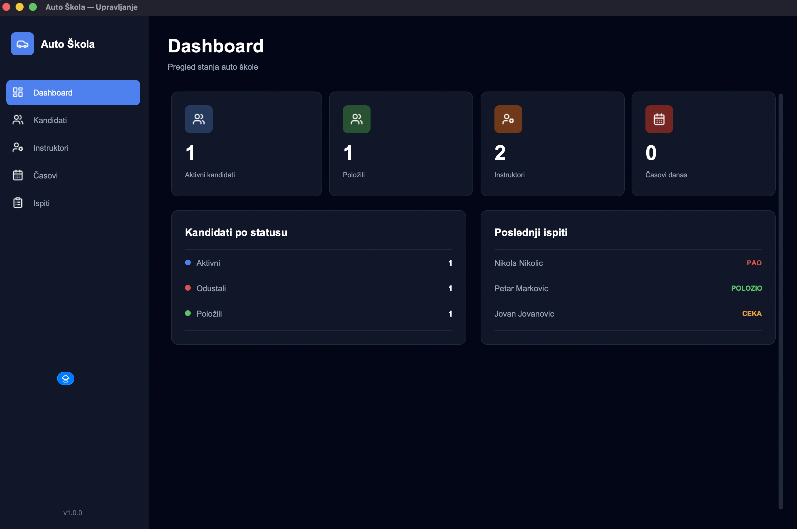
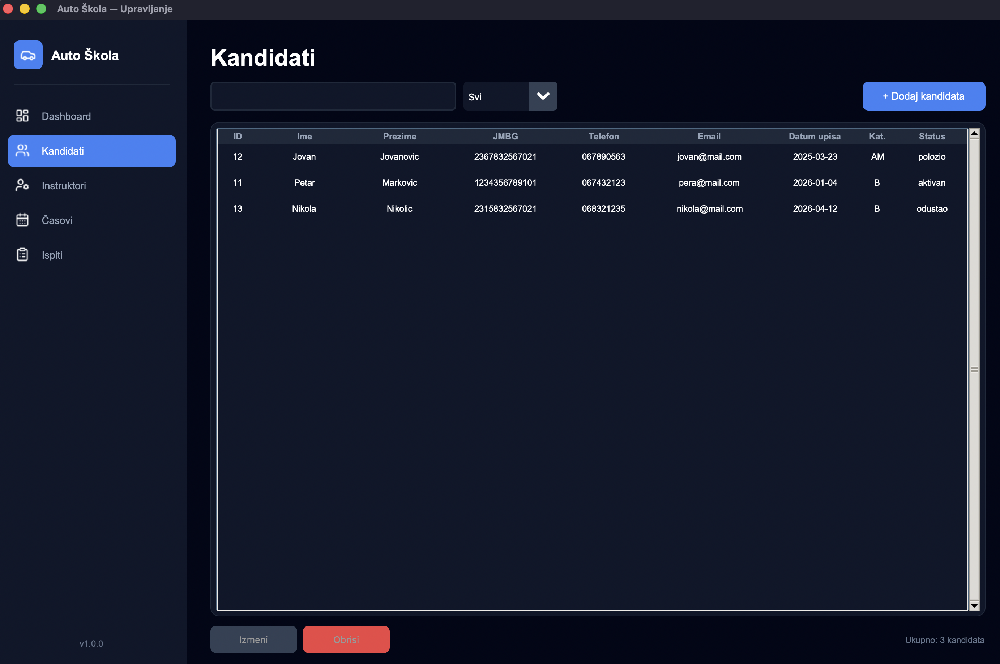

# Auto Škola — Desktop Aplikacija

Desktop aplikacija za upravljanje poslovanjem auto škole, razvijena kao studentski projekat.

## O projektu

Aplikacija omogućava evidenciju kandidata, instruktora, časova i ispita sa modernim dark UI-em.

## Tehnologije

- **Python 3.11**
- **CustomTkinter** — moderni GUI framework
- **SQLite** — lokalna baza podataka
- **Pillow** — obrada slika i ikonica

## Funkcionalnosti

- **Dashboard** — pregled ključnih statistika
- **Kandidati** — dodavanje, pregled i upravljanje kandidatima
- **Instruktori** — evidencija instruktora i kategorija
- **Časovi** — zakazivanje i praćenje časova vožnje
- **Ispiti** — evidencija teorijskih i praktičnih ispita

## Pokretanje

### Preduslovi

```bash
pip install customtkinter pillow
```

### Pokretanje aplikacije

```bash
git clone https://github.com/uros-cvetkovski/auto-skola.git
cd auto-skola
python main.py
```

## Struktura projekta

```
auto_skola/
├── main.py              # Ulazna tačka aplikacije
├── database/
│   └── db_manager.py    # Upravljanje SQLite bazom
├── models/
│   ├── kandidat.py
│   ├── instruktor.py
│   └── cas_ispit.py
├── views/
│   ├── dashboard_view.py
│   ├── kandidati_view.py
│   ├── instruktori_view.py
│   ├── casovi_view.py
│   └── ispiti_view.py
└── assets/
    └── icons/
```
## Screenshots




## Autor

**Uroš Cvetkovksi** — [github.com/uros-cvetkovski](https://github.com/uros-cvetkovski)
